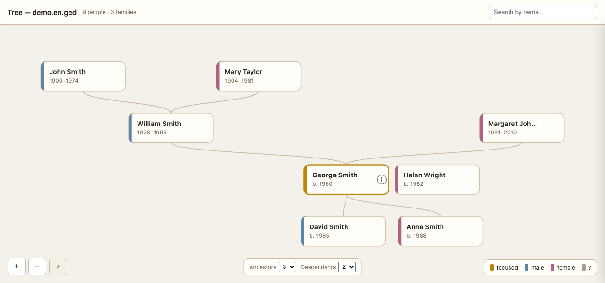
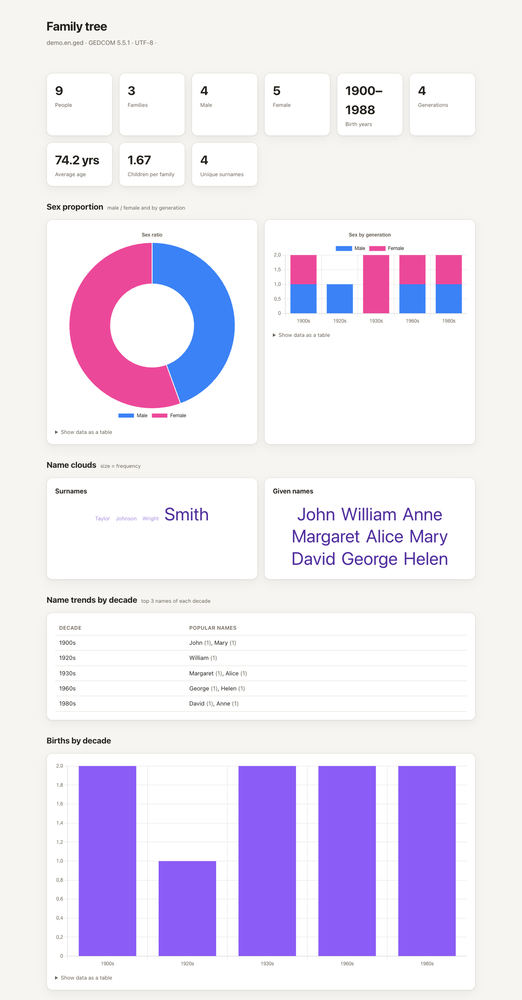

# genealogy-skills

**English** · [Русский](README.ru.md)

**Turn your AI assistant into a genealogist.** Four skills that let Claude (and
other agents) read, build, analyse and visualise **GEDCOM** family trees from a
`.ged` file.

Ask in plain language — *"Who are this person's descendants?"*, *"Make me a
report of my tree"*, *"I have no tree yet, help me start one"* — and the agent
does the rest. Pure Python 3 + `bash`: nothing to `pip install`, runs locally,
UTF-8 / Cyrillic-safe.


*gedcom-tree — interactive viewer*


*gedcom-report — analytics dashboard*

<sub>Both generated from the bundled fictional `examples/demo.en.ged`. The UI is
localized — Cyrillic trees render in Russian, Latin ones in English (or force it
with `--lang ru|en`).</sub>

## The four skills

| Skill | What it does |
|---|---|
| **gedcom-reader** | Read a `.ged` and answer questions about people, dates and relationships. Also builds/edits trees — add people, set facts, link spouses/children — with automatic backups. **Start here.** |
| **gedcom-report** | A 12-section analytics **dashboard**: counts, charts, name cloud, birthday heatmap, timeline and a data-quality check, as one HTML file. |
| **gedcom-tree** | An **interactive HTML tree viewer** centred on a person: ancestors above, descendants below, click-to-recenter, pan/zoom, name search — plus an **ⓘ detail panel** per card (notes, sources, document/scan links, relatives). |
| **genealogy-research** | Plan research with the **Genealogical Proof Standard**, keep an Obsidian vault, and **start a tree from nothing** through a short interview. |

You need only **gedcom-reader** to get going; add the others as you want reports,
a visual tree, or research help.

## Install

### Claude Desktop or claude.ai (no terminal)

1. **Download** the skill ZIPs from [`download-skills/`](download-skills/) — open
   each and click **Download raw file**:
   [gedcom-reader.zip](download-skills/gedcom-reader.zip) ·
   [gedcom-report.zip](download-skills/gedcom-report.zip) ·
   [gedcom-tree.zip](download-skills/gedcom-tree.zip) ·
   [genealogy-research.zip](download-skills/genealogy-research.zip)
2. In Claude, turn on **Settings → Capabilities → Code execution**.
3. Go to **Customize → Skills → “+” → Upload a skill** and upload each `.zip`.

Then start a chat and ask about your family tree. (Just `gedcom-reader.zip` is
enough to begin.) Skills you enable here also show up in the Claude for
Excel / Word / PowerPoint / Outlook add-ins.

### Claude Code · Codex · opencode · other CLI agents

Skills are just folders with a `SKILL.md`. Run `install.sh` **from your
project's root** — it copies them into the right dotfolder for your agent:

```bash
./install.sh claude       # -> ./.claude/skills     (Claude Code)
./install.sh codex        # -> ./.agents/skills     (Codex)
./install.sh opencode     # -> ./.opencode/skills   (opencode, + agent & tools)
```

Or pass an explicit path to install anywhere (e.g. globally):
`./install.sh ~/.claude/skills`. Restart the agent afterwards. Any agent that
reads `SKILL.md` works the same way — just copy the `skills/*` folders into the
directory it scans.

**opencode** gets extra goodies from `./install.sh opencode`: a `genealogist`
agent, native `gedcom_*` write tools, and an `opencode.json` pre-wired for the
Playwright browser MCP (see below). An existing `opencode.json` is left
untouched.

### Updating an existing install

New version out? Update the copy you already installed:

- **Claude Desktop / claude.ai** — download the newer `.zip`(s) from
  [`download-skills/`](download-skills/) and re-upload them under
  **Customize → Skills → “+” → Upload a skill**. If Claude keeps showing the old
  version, delete the skill from the Skills list first, then upload again.

- **Claude Code · Codex · opencode · other CLI agents** — refresh this repo, then
  re-run the same install command from your project root and restart the agent:

  ```bash
  git pull                      # or re-download the repo
  ./install.sh opencode         # same target you used before (+ project-dir if any)
  ```

  Re-running **overwrites** the installed `skills/*` folders in place (they're
  copies, so this is safe) — you always get the latest scripts.

- **opencode, one caveat** — to avoid clobbering your customizations, the
  installer **does not overwrite** an existing `opencode.json`, `package.json`,
  or a `genealogist.md` you've edited; the native `gedcom_*` tools *are* always
  refreshed. If a new version changes the agent, config, or plugin deps, the
  installer prints `= … left untouched` — compare your file with the matching one
  under [`opencode-extras/`](opencode-extras/) and merge the changes by hand (or
  rename yours and re-run to get a fresh copy).

## Try it

No agent needed — run the bundled fictional family straight from a shell:

```bash
# Who descends from Иван Петров?
PYTHONIOENCODING=utf-8 python3 skills/gedcom-reader/scripts/gedcom.py \
  examples/demo.ged descendants "Иван Петров"

# Build an analytics dashboard  ->  examples/demo.report.html
PYTHONIOENCODING=utf-8 python3 skills/gedcom-report/scripts/report.py examples/demo.ged

# Build an interactive tree viewer  ->  examples/demo.tree.html
PYTHONIOENCODING=utf-8 python3 skills/gedcom-tree/scripts/tree.py \
  examples/demo.ged --focus "Сергей Петров"
```

Building and editing trees goes through `gedcom_write.py`, which backs up the
file on every write, keeps family links consistent both ways, and re-parses to
sanity-check. **No file yet?** Just ask the agent to help you start — it runs a
short interview (you → parents → grandparents → siblings), accepts *"I don't
know"* and approximate years, and marks memory-based facts as *Unproven*.

## Browser research (optional)

The `genealogy-research` skill can drive a **web browser** to look up records in
online archives (parish/vital registers, censuses, military databases). It works
without one, but a browser turns "advises you where to look" into "opens the
archive and reads the scan for you."

This uses a browser MCP — we recommend
[Playwright MCP](https://github.com/microsoft/playwright-mcp):

- **opencode** — already wired by `./install.sh opencode`.
- **Claude Desktop / Code** — `claude mcp add playwright -- npx @playwright/mcp@latest`
- **Other MCP agents** — register `npx @playwright/mcp@latest` as a local MCP server.

Needs Node/`npx`. Without a browser MCP, the agent falls back to asking you to
paste a screenshot.

## Privacy

GEDCOM files hold **personal data about living people**. The tools run
**locally** and never touch the network, with one exception: `gedcom-report`
loads Chart.js from a CDN (plain-table fallback offline). The browser MCP is
opt-in, and only when you enable browser research. This repo's `.gitignore` keeps
every `*.ged` out of version control except the fictional `examples/demo.ged` —
keep your own family data local.

## Requirements & tests

Python 3 and `bash` — that's it for the skills. The optional opencode plugins and
Playwright MCP need Node/`npx`.

```bash
PYTHONIOENCODING=utf-8 python3 -m unittest discover -s tests -v
```

Pure-stdlib test suite; also runs in CI on Python 3.9 and 3.12. See
[`AGENTS.md`](AGENTS.md) for a map of the project.

## License

MIT — see [LICENSE](./LICENSE). Contributions welcome.
