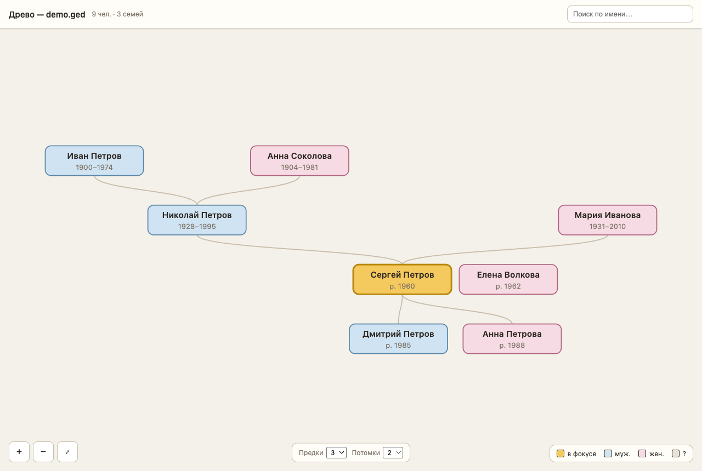
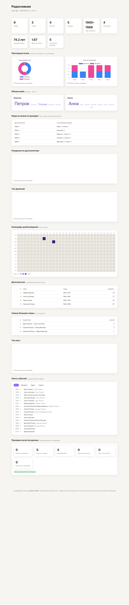

# genealogy-skills

[English](README.md) · **Русский**

**Превратите вашего ИИ-ассистента в генеалога.** Четыре навыка (skills),
которые позволяют Claude (и другим агентам) читать, строить, анализировать и
визуализировать семейные деревья **GEDCOM** из файла `.ged`.

Спрашивайте обычным языком — *«Кто потомки этого человека?»*, *«Сделай мне
отчёт по моему дереву»*, *«У меня ещё нет дерева, помоги начать»* — а остальное
сделает агент. Чистый Python 3 + `bash`: ничего не нужно ставить через
`pip`, работает локально, поддерживает UTF-8 / кириллицу.

|  |  |
|---|---|
|  |  |
| *gedcom-tree — интерактивный просмотр* | *gedcom-report — аналитический дашборд* |

<sub>Оба сгенерированы из вымышленного примера `examples/demo.ged`.</sub>

## Четыре навыка

| Навык | Что делает |
|---|---|
| **gedcom-reader** | Читает `.ged` и отвечает на вопросы о людях, датах и родстве. Также строит и редактирует деревья — добавляет людей, задаёт факты, связывает супругов и детей — с автоматическими бэкапами. **Начните отсюда.** |
| **gedcom-report** | Аналитический **дашборд** из 12 разделов: подсчёты, графики, облако имён, тепловая карта дней рождения, таймлайн и проверка качества данных — одним HTML-файлом. |
| **gedcom-tree** | **Интерактивный HTML-просмотр дерева** с центром на человеке: предки сверху, потомки снизу, клик для перецентровки, панорама/зум, поиск по имени. |
| **genealogy-research** | Планирование исследования по **стандарту генеалогического доказательства (GPS)**, ведение хранилища Obsidian и **построение дерева с нуля** через короткое интервью. |

Для старта достаточно **gedcom-reader**; остальные добавляйте по мере
необходимости — отчёты, визуальное дерево или помощь в исследовании.

## Установка

### Claude Desktop или claude.ai (без терминала)

1. **Скачайте** ZIP-архивы навыков из [`download-skills/`](download-skills/) —
   откройте каждый и нажмите **Download raw file**:
   [gedcom-reader.zip](download-skills/gedcom-reader.zip) ·
   [gedcom-report.zip](download-skills/gedcom-report.zip) ·
   [gedcom-tree.zip](download-skills/gedcom-tree.zip) ·
   [genealogy-research.zip](download-skills/genealogy-research.zip)
2. В Claude включите **Settings → Capabilities → Code execution**.
3. Откройте **Customize → Skills → «+» → Upload a skill** и загрузите каждый `.zip`.

Затем начните чат и спросите про своё семейное дерево. (Для начала хватит
одного `gedcom-reader.zip`.) Чтобы обновить навык позже, загрузите новый `.zip` —
если Claude продолжает показывать старый, сначала удалите его из списка Skills и
загрузите заново. Включённые здесь навыки также доступны в надстройках Claude для
Excel / Word / PowerPoint / Outlook.

### Claude Code · Codex · opencode · другие CLI-агенты

Навыки — это просто папки с файлом `SKILL.md`. Запустите `install.sh` **из
корня вашего проекта** — он скопирует их в нужную dot-папку для вашего агента:

```bash
./install.sh claude       # -> ./.claude/skills     (Claude Code)
./install.sh codex        # -> ./.agents/skills     (Codex)
./install.sh opencode     # -> ./.opencode/skills   (opencode, + агент и инструменты)
```

Либо укажите явный путь, чтобы установить куда угодно (например, глобально):
`./install.sh ~/.claude/skills`. После установки перезапустите агента. Любой
агент, который читает `SKILL.md`, работает так же — просто скопируйте папки
`skills/*` в каталог, который он сканирует.

**opencode** получает дополнительные бонусы от `./install.sh opencode`: агента
`genealogist`, нативные инструменты записи `gedcom_*` и `opencode.json`, заранее
настроенный на браузерный MCP Playwright (см. ниже). Существующий `opencode.json`
не перезаписывается.

## Попробовать

Агент не нужен — запустите вымышленную семью прямо из консоли:

```bash
# Кто потомки Ивана Петрова?
PYTHONIOENCODING=utf-8 python3 skills/gedcom-reader/scripts/gedcom.py \
  examples/demo.ged descendants "Иван Петров"

# Построить аналитический дашборд  ->  examples/demo.report.html
PYTHONIOENCODING=utf-8 python3 skills/gedcom-report/scripts/report.py examples/demo.ged

# Построить интерактивное дерево  ->  examples/demo.tree.html
PYTHONIOENCODING=utf-8 python3 skills/gedcom-tree/scripts/tree.py \
  examples/demo.ged --focus "Сергей Петров"
```

Построение и редактирование деревьев идёт через `gedcom_write.py`, который
делает бэкап файла при каждой записи, поддерживает связи в семье в обе стороны и
перечитывает файл для самопроверки. **Ещё нет файла?** Просто попросите агента
помочь начать — он проведёт короткое интервью (вы → родители → бабушки и дедушки
→ братья и сёстры), примет ответ *«не знаю»* и приблизительные годы, а факты по
памяти пометит как *Unproven* (не доказано).

## Исследование через браузер (опционально)

Навык `genealogy-research` может управлять **браузером**, чтобы искать записи в
онлайн-архивах (метрические/церковные книги, переписи, военные базы). Он работает
и без браузера, но с ним «подсказывает, где искать» превращается в «открывает
архив и читает скан за вас».

Для этого используется браузерный MCP — рекомендуем
[Playwright MCP](https://github.com/microsoft/playwright-mcp):

- **opencode** — уже настроен через `./install.sh opencode`.
- **Claude Desktop / Code** — `claude mcp add playwright -- npx @playwright/mcp@latest`
- **Другие MCP-агенты** — зарегистрируйте `npx @playwright/mcp@latest` как локальный MCP-сервер.

Нужен Node/`npx`. Без браузерного MCP агент попросит вас вставить скриншот.

## Приватность

GEDCOM-файлы содержат **персональные данные живущих людей**. Инструменты
работают **локально** и не обращаются к сети — с одним исключением: `gedcom-report`
подгружает Chart.js с CDN (без сети переходит на обычные таблицы). Браузерный MCP —
опционален и включается только когда вы сами запускаете исследование через браузер.
`.gitignore` этого репозитория держит все `*.ged` вне контроля версий, кроме
вымышленного `examples/demo.ged` — держите свои семейные данные локально.

## Требования и тесты

Python 3 и `bash` — это всё, что нужно навыкам. Опциональные плагины opencode и
Playwright MCP требуют Node/`npx`.

```bash
PYTHONIOENCODING=utf-8 python3 -m unittest discover -s tests -v
```

Набор тестов на чистой стандартной библиотеке; также прогоняется в CI на Python
3.9 и 3.12. Карта проекта — в [`AGENTS.md`](AGENTS.md).

## Лицензия

MIT — см. [LICENSE](./LICENSE). Контрибуции приветствуются.
